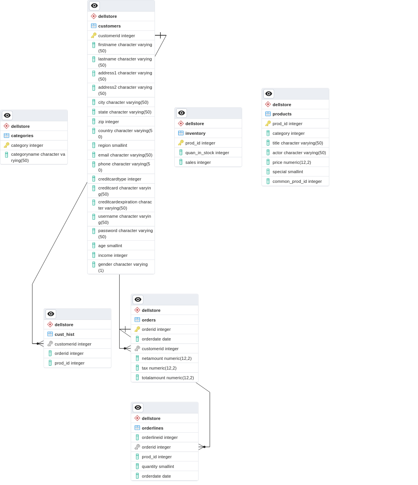

# sqlGPT

This project is for drilling my skills in React and Express. The idea is buidling a full stack app that is able to query a SQL database with natural language.

1. Frontend takes user input of natural language
2. Frontend passes the input to backend
3. Backend consturcts a prompt along with the input and make a POST requrest to OpenAI API's completion endpoint
4. The API would return SQL query string for querying database
5. Query the database with the query string and return data to the frontend

- For database schema, check `dellstore2-normal-1.0.sql`, remember to add constraints and index

